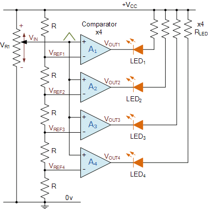

# Deliverable 4 - Complete by 11/17/2025 
As a note, make sure deliverables are completed <b>BEFORE</b> your next meeting! This allows me to help you debug circuits or code by the time I get to the meeting.

## Hardware Deliverable

1. Build a comparator using 4 op-amps (look for TL084 in Driftmier 1450).

    

For more information: https://www.electronics-tutorials.ws/opamp/op-amp-comparator.html

As per usual, build on Multisim/Simulink, test with an oscilloscope on the simulation, then build on hardware and test. Charts are absolutely necessary here.

Describe what is happening in each portion of the circuit. 

2. Create a CAD sketch of the alarm clock system. Represent everything - RP5, Screen, Pogo Pins, Wearable. Look online for the size of the components. 

3. Research how a PCB works and best practices when developing a PCB. As Omar discussed, the placement of components on a PCB matters. 

#### Note
I need to see visuals - graphs you obtain, calculations that you took, circuit diagrams, etc.

## Software Deliverable 
1. Continue the development of the UI. Show me screenshots of the initial design.

2. As discussed with Neel, look for more datasets that you can work with. Integrate them into your program. Print out the following statistics: average heart rate, average sleep time. 

3. *(Optional, but recommended)* Complete 2 LeetCode problems.
